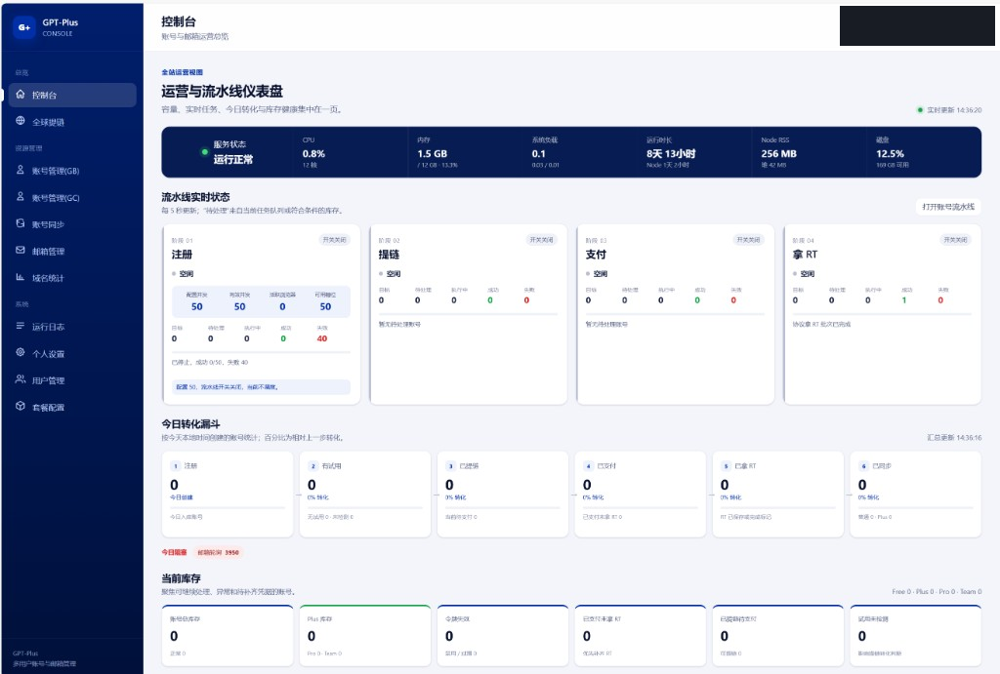
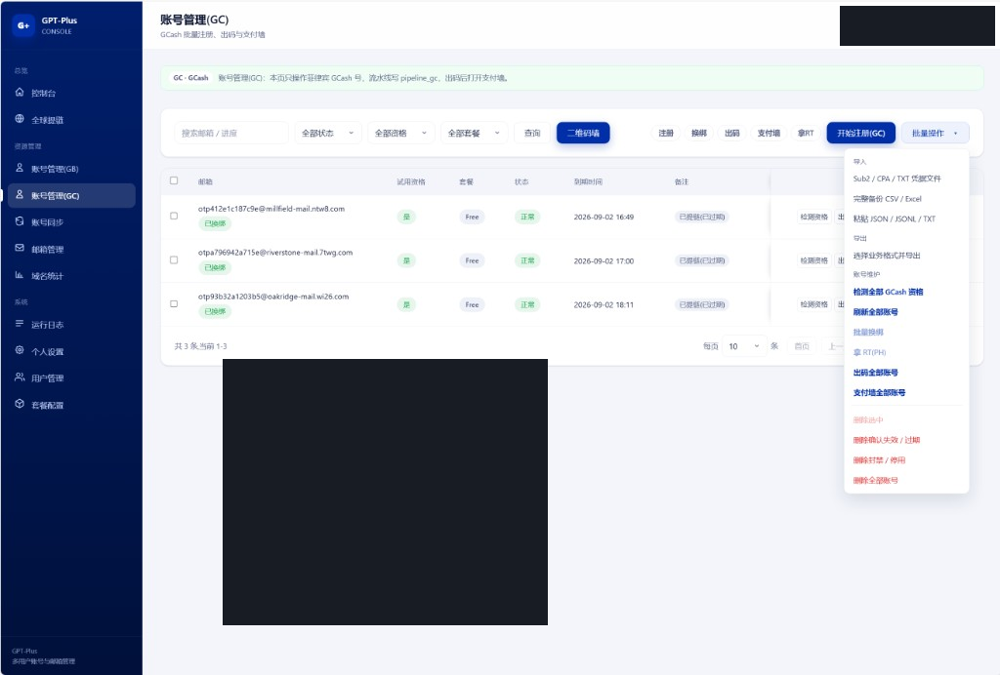
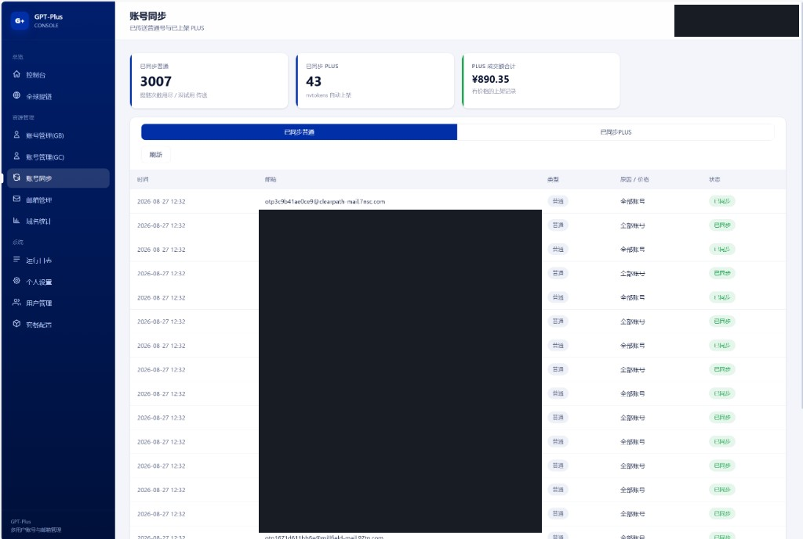

# GPT-Plus 多用户管理控制台

基于 Node.js + Express + SQLite + Vue3 的多用户 GPT 账号 / 邮箱管理系统，克莱因蓝企业控制台风格。

**本仓库是公开展示仓**（欢迎 Star）。完整业务源码在私有仓，路人 `git clone` 这里拿不到可运行的全部代码。

交流 / 申请完整源码：**QQ 群 19302577**

## 界面参考







## 能做什么

- 控制台：账号 / 邮箱统计、套餐到期、流水线状态
- 账号管理 GB / GC：注册、提链、支付墙、拿 RT
- 账号同步：普通号与 PLUS 上架记录
- 邮箱、域名、运行日志、个人设置与套餐配置

## 配置说明（无密钥）

字段名、默认值和占位符见 **[docs/CONFIG.md](docs/CONFIG.md)**。根目录 `.env.example` 只是模板，**不要提交真实 `.env`**。

## 申请完整源码（私募拉取）

1. 加入 QQ 群 **19302577** 说明用途
2. 通过后会被加到私有仓协作者（`432539/gpt-plus`）
3. 授权后再拉：

```bash
gh repo clone 432539/gpt-plus
# 或
git clone git@github.com:432539/gpt-plus.git
```

未授权访问私有仓会 404。不要把 token 写进仓库或脚本。

## 开源地址

https://github.com/432539/gpt
